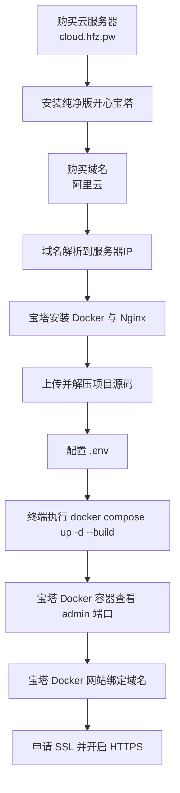

# Dujiaoka-Next Docker 服务器部署流程（宝塔版）

这份文档按你的实际操作路径编写：  
`买服务器 -> 买域名 -> 宝塔安装 Docker/Nginx -> 上传源码 -> 一条命令启动 -> 域名+SSL`

## 总流程图（图解）



## 第 1 步：购买服务器并安装宝塔

1. 在 `cloud.hfz.pw` 购买 Linux 云服务器（建议 Ubuntu 22.04）。
2. 重装系统后，安装“纯净版开心宝塔”。
3. 登录宝塔面板，完成初始化账号密码设置。

## 第 2 步：购买域名并解析

1. 在阿里云购买域名。
2. 在域名解析里添加 A 记录，指向你的服务器公网 IP。
3. 建议至少准备以下记录：
- `@` -> 服务器 IP
- `www` -> 服务器 IP
- `admin` -> 服务器 IP（后台域名，可选）

## 第 3 步：宝塔安装 Docker 和 Nginx

1. 进入宝塔首页。
2. 在应用商店安装 `Docker`。
3. 在应用商店安装 `Nginx`。
4. 安装完成后，确认 Docker 服务状态为运行中。

## 第 4 步：上传并解压源码

1. 从 Releases 下载源码包：  
   [https://github.com/cnmbdb/Dujiaoka-Next-Docker/releases](https://github.com/cnmbdb/Dujiaoka-Next-Docker/releases)
2. 在宝塔“文件”页面上传压缩包到站点目录（例如 `/www/wwwroot/dujiaoka-next`）。
3. 解压源码到项目目录。
4. 按你的要求，把项目目录权限设置为 `www / 777`。

## 第 5 步：配置 .env 并启动

1. 在项目根目录编辑唯一环境文件 `.env`。
2. 在宝塔文件页进入该目录，点击顶部“终端”。
3. 执行启动命令：

```bash
docker compose up -d --build
```

## 第 6 步：查看容器并进入后台

1. 回到宝塔首页 -> Docker -> 容器。
2. 找到 `admin` 容器。
3. 查看端口映射并点击访问，使用 `服务器IP:端口` 打开后台。

默认登录地址示例：
- `http://服务器IP:3002/login`

默认账号密码：
- 账号：`admin`
- 密码：`admin123`

## 第 7 步：绑定域名并启用 HTTPS

1. 宝塔首页 -> Docker -> 网站。
2. 添加网站并绑定你的域名。
3. 在网站 SSL 页面申请证书（Let's Encrypt）。
4. 开启强制 HTTPS。

## 常用运维命令

首次或常规更新：

```bash
docker compose up -d --build
```

如果改的是端口、镜像标签、容器启动参数等 Compose 级配置：

```bash
docker compose up -d --force-recreate
```

查看状态：

```bash
docker compose ps
```

查看日志：

```bash
docker compose logs -f
```

## 备注

- 本项目使用远程镜像部署。
- 运行配置只使用一个 `.env` 文件（已挂载，可动态修改）。
