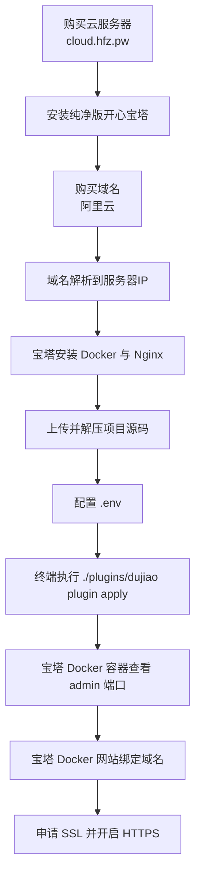

# Dujiaoka-Next Docker 服务器部署流程（宝塔版）

这份文档按你的实际操作路径编写：  
`买服务器 -> 买域名 -> 宝塔安装 Docker/Nginx -> 上传源码 -> 一条命令启动 -> 域名+SSL`

## 总流程图（图解）


```mermaid
flowchart TD
    A["购买云服务器<br/>cloud.hfz.pw"] --> B["安装纯净版开心宝塔"]
    B --> C["购买域名<br/>阿里云"]
    C --> D["域名解析到服务器IP"]
    D --> E["宝塔安装 Docker 与 Nginx"]
    E --> F["上传并解压项目源码"]
    F --> G["配置 .env"]
    G --> H["终端执行 ./plugins/dujiao plugin apply"]
    H --> I["宝塔 Docker 容器查看 admin 端口"]
    I --> J["宝塔 Docker 网站绑定域名"]
    J --> K["申请 SSL 并开启 HTTPS"]
```

## 第 1 步：购买服务器并安装宝塔

1. 在 `cloud.hfz.pw` 购买 Linux 云服务器（建议 Ubuntu 22.04）。
2. 重装系统后，安装“纯净版开心宝塔”。
3. 登录宝塔面板，完成初始化账号密码设置。

## 第 2 步：购买域名并解析

1. 在阿里云购买域名。
2. 在域名解析里添加 A 记录，指向你的服务器公网 IP。
3. 建议至少准备以下记录：
- `@` -> 服务器 IP
- `www` -> 服务器 IP
- `admin` -> 服务器 IP（后台域名，可选）

## 第 3 步：宝塔安装 Docker 和 Nginx

1. 进入宝塔首页。
2. 在应用商店安装 `Docker`。
3. 在应用商店安装 `Nginx`。
4. 安装完成后，确认 Docker 服务状态为运行中。

## 第 4 步：上传并解压源码

1. 从 Releases 下载源码包：  
   [https://github.com/cnmbdb/Dujiaoka-Next-Docker/releases](https://github.com/cnmbdb/Dujiaoka-Next-Docker/releases)
2. 在宝塔“文件”页面上传压缩包到站点目录（例如 `/www/wwwroot/dujiaoka-next`）。
3. 解压源码到项目目录。
4. 按你的要求，把项目目录权限设置为 `www / 777`。

## 第 5 步：配置 .env 并启动

1. 在项目根目录编辑主环境文件 `.env`。
2. 查看可用插件：

```bash
./plugins/dujiao plugin list
```

首次应用时会自动从 `.env.example` 创建 App Store 自己的 `.env`，并生成安全 API Token。
3. 在宝塔文件页进入该目录，点击顶部“终端”。
4. 执行启动命令：

```bash
chmod +x plugins/dujiao
./plugins/dujiao plugin apply
```

`.env` 关键开关说明：
- 默认生产部署不映射宿主机端口。
- Cloudflare Tunnel 作为可选插件放在 `plugins/cftun/`，公网域名和 Tunnel Token 不放主 `.env`。

注意事项（重要）：
1. 改完 `HOST_BIND_IP` 后，必须执行：

```bash
    ./plugins/dujiao plugin apply
```

2. 当前 `.env` 里 `API_URL` 为 `http://127.0.0.1:3001`，上域名后必须改为公网 API 域名（例如 `https://api.xxx.com`），否则浏览器会请求回环地址。
3. 当前生产 Compose 不开放 `IP:端口` 访问，这是正常现象；应通过 Cloudflare Tunnel 域名访问。

## 第 6 步：查看容器并进入后台

1. 回到宝塔首页 -> Docker -> 容器。
2. 找到 `admin` 容器。
3. 查看端口映射并点击访问，使用 `服务器IP:端口` 打开后台。

默认登录地址示例：
- `http://服务器IP:3002/login`

默认账号密码：
- 账号：`admin`
- 密码：`admin123`

## 第 7 步：绑定域名并启用 HTTPS

1. 宝塔首页 -> Docker -> 网站。
2. 添加网站并绑定你的域名。
3. 在网站 SSL 页面申请证书（Let's Encrypt）。
4. 开启强制 HTTPS。
5. 本项目默认不开放外部 `IP:端口` 访问；确认 Cloudflare Tunnel 域名可用后即可。

## 常用运维命令

首次或常规更新：

```bash
git pull
./plugins/dujiao plugin apply
```

如果改的是端口、镜像标签、容器启动参数等 Compose 级配置：

```bash
./plugins/dujiao plugin apply
```

查看状态：

```bash
./plugins/dujiao plugin command ps
```

查看日志：

```bash
./plugins/dujiao plugin command logs -f
```

## 插件管理

生产仓库默认只保留两个插件目录：

```text
plugins/
├── dujiao                  # 从插件目录启动整个宿主与核心 App Store
├── host/                   # Compose 覆盖与 Admin 插件版 Nginx
├── loader.js               # 主后台唯一注入入口
├── appstore/               # 核心插件，永久加载，管理其他插件
└── cftun/                  # Cloudflare Tunnel，默认停用
```

标准插件包是一个可以直接放入 `plugins/` 的完整目录：

```text
plugins/<plugin-id>/
├── plugin.json
├── docker-compose.yml
├── .env.example
├── backend/
├── admin/
├── public/
├── migrations/
└── hooks/
```

`plugins/appstore` 拥有插件管理核心权限，随主系统永久加载，不能被停用。它负责插件包的安装、启用、禁用、配置和删除，并使用远程镜像运行。其他插件安装后默认保持停用。

`.env` 与 `.enabled` 是本机状态，不提交到仓库。插件自己的配置只保存在对应目录的 `.env`，不会混入主系统 `.env`。

把第三方插件完整文件夹放进 `plugins/` 后，直接在 App Store 后台安装、配置、启用、禁用和删除。宿主命令行只负责核心 App Store 与主系统编排：

```bash
./plugins/dujiao plugin list
./plugins/dujiao plugin apply
```

应用当前插件状态：

```bash
./plugins/dujiao plugin apply
```

插件服务不开放宿主机端口，通过 Docker 内部网络、后台代理或 Cloudflare Tunnel 访问。

## Cloudflare Tunnel

Cloudflare Tunnel 已经拆成独立插件。先复制插件环境文件：

```bash
cp plugins/cftun/.env.example plugins/cftun/.env
```

然后在 `plugins/cftun/.env` 中填写：

```bash
CLOUDFLARE_TUNNEL_ENABLED=true
CFTUN_TUNNEL_ID=你的 Tunnel ID
TUNNEL_ID=你的 Tunnel ID
TUNNEL_TOKEN=你的 Cloudflare Tunnel Token

PUBLIC_USER_HOST=dujiao-next-user.example.com
PUBLIC_ADMIN_HOST=dujiao-next-admin.example.com
PUBLIC_API_HOST=dujiao-next-api.example.com
PUBLIC_USER_URL=https://dujiao-next-user.example.com
PUBLIC_ADMIN_URL=https://dujiao-next-admin.example.com
PUBLIC_API_URL=https://dujiao-next-api.example.com
```

配置保存后，在 App Store 的本机插件管理页面启用 CFTun。

## 备注

- 核心 API/User/Admin 与官方插件默认使用远程镜像；第三方插件可在自己的 Compose 中声明远程镜像或本地构建。
- 主服务配置放根目录 `.env`；插件配置放各自插件目录的 `.env`。
- 普通版本只需放入完整 `plugins/` 文件夹并执行 `./plugins/dujiao plugin apply`；无需修改根 Compose 或 Nginx。
- 主系统通过 `plugins/host` 覆盖永久只加载 `/plugins/loader.js`；插件启停、路由与页面注入由 App Store 统一管理。
