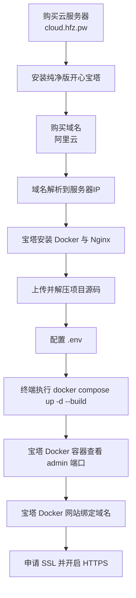

# Dujiaoka-Next Docker 服务器部署流程（宝塔版）

这份文档按你的实际操作路径编写：  
`买服务器 -> 买域名 -> 宝塔安装 Docker/Nginx -> 上传源码 -> 一条命令启动 -> 域名+SSL`

## 总流程图（图解）


```mermaid
flowchart TD
    A["购买云服务器<br/>cloud.hfz.pw"] --> B["安装纯净版开心宝塔"]
    B --> C["购买域名<br/>阿里云"]
    C --> D["域名解析到服务器IP"]
    D --> E["宝塔安装 Docker 与 Nginx"]
    E --> F["上传并解压项目源码"]
    F --> G["配置 .env"]
    G --> H["终端执行 docker compose up -d --build"]
    H --> I["宝塔 Docker 容器查看 admin 端口"]
    I --> J["宝塔 Docker 网站绑定域名"]
    J --> K["申请 SSL 并开启 HTTPS"]
```

## 第 1 步：购买服务器并安装宝塔

1. 在 `cloud.hfz.pw` 购买 Linux 云服务器（建议 Ubuntu 22.04）。
2. 重装系统后，安装“纯净版开心宝塔”。
3. 登录宝塔面板，完成初始化账号密码设置。

## 第 2 步：购买域名并解析

1. 在阿里云购买域名。
2. 在域名解析里添加 A 记录，指向你的服务器公网 IP。
3. 建议至少准备以下记录：
- `@` -> 服务器 IP
- `www` -> 服务器 IP
- `admin` -> 服务器 IP（后台域名，可选）

## 第 3 步：宝塔安装 Docker 和 Nginx

1. 进入宝塔首页。
2. 在应用商店安装 `Docker`。
3. 在应用商店安装 `Nginx`。
4. 安装完成后，确认 Docker 服务状态为运行中。

## 第 4 步：上传并解压源码

1. 从 Releases 下载源码包：  
   [https://github.com/cnmbdb/Dujiaoka-Next-Docker/releases](https://github.com/cnmbdb/Dujiaoka-Next-Docker/releases)
2. 在宝塔“文件”页面上传压缩包到站点目录（例如 `/www/wwwroot/dujiaoka-next`）。
3. 解压源码到项目目录。
4. 按你的要求，把项目目录权限设置为 `www / 777`。

## 第 5 步：配置 .env 并启动

1. 在项目根目录编辑主环境文件 `.env`。
2. 如果启用插件，再分别复制并编辑插件自己的环境文件：

```bash
cp plugins/appstore-expand/.env.example plugins/appstore-expand/.env
cp plugins/dujiao-bot/.env.example plugins/dujiao-bot/.env
cp plugins/cftun/.env.example plugins/cftun/.env
```

插件配置各自放在对应插件目录里，主 `.env` 只保留核心服务配置。
3. 在宝塔文件页进入该目录，点击顶部“终端”。
4. 执行启动命令：

```bash
docker compose up -d
```

`.env` 关键开关说明：
- 默认生产部署不映射宿主机端口。
- Cloudflare Tunnel 作为可选插件放在 `plugins/cftun/`，公网域名和 Tunnel Token 不放主 `.env`。

注意事项（重要）：
1. 改完 `HOST_BIND_IP` 后，必须执行：

```bash
docker compose up -d --force-recreate
```

2. 当前 `.env` 里 `API_URL` 为 `http://127.0.0.1:3001`，上域名后必须改为公网 API 域名（例如 `https://api.xxx.com`），否则浏览器会请求回环地址。
3. 当前生产 Compose 不开放 `IP:端口` 访问，这是正常现象；应通过 Cloudflare Tunnel 域名访问。

## 第 6 步：查看容器并进入后台

1. 回到宝塔首页 -> Docker -> 容器。
2. 找到 `admin` 容器。
3. 查看端口映射并点击访问，使用 `服务器IP:端口` 打开后台。

默认登录地址示例：
- `http://服务器IP:3002/login`

默认账号密码：
- 账号：`admin`
- 密码：`admin123`

## 第 7 步：绑定域名并启用 HTTPS

1. 宝塔首页 -> Docker -> 网站。
2. 添加网站并绑定你的域名。
3. 在网站 SSL 页面申请证书（Let's Encrypt）。
4. 开启强制 HTTPS。
5. 本项目默认不开放外部 `IP:端口` 访问；确认 Cloudflare Tunnel 域名可用后即可。

## 常用运维命令

首次或常规更新：

```bash
docker compose pull
docker compose up -d
```

如果改的是端口、镜像标签、容器启动参数等 Compose 级配置：

```bash
docker compose up -d --force-recreate
```

查看状态：

```bash
docker compose ps
```

查看日志：

```bash
docker compose logs -f
```

## 可选插件

核心项目只保留必要服务。插件放在各自文件夹内，每个插件都有独立的 compose 覆盖文件和 `.env.example`：

```text
plugins/
  cftun/
    docker-compose.yml
    .env.example
    .env
  appstore-expand/
    docker-compose.yml
    .env.example
    .env
  dujiao-bot/
    docker-compose.yml
    .env.example
    .env
```

`.env` 文件不提交到仓库，部署时从对应 `.env.example` 复制后填写。

启用应用商店扩展：

```bash
docker compose \
  --env-file .env \
  --env-file plugins/appstore-expand/.env \
  -f docker-compose.yml \
  -f plugins/appstore-expand/docker-compose.yml \
  up -d --force-recreate
```

启用 Dujiao Bot：

```bash
docker compose \
  --env-file .env \
  --env-file plugins/dujiao-bot/.env \
  -f docker-compose.yml \
  -f plugins/dujiao-bot/docker-compose.yml \
  up -d --force-recreate
```

同时启用应用商店扩展和 Dujiao Bot：

```bash
docker compose \
  --env-file .env \
  --env-file plugins/appstore-expand/.env \
  --env-file plugins/dujiao-bot/.env \
  -f docker-compose.yml \
  -f plugins/appstore-expand/docker-compose.yml \
  -f plugins/dujiao-bot/docker-compose.yml \
  up -d --force-recreate
```

启用 Cloudflare Tunnel：

```bash
docker compose \
  --env-file .env \
  --env-file plugins/cftun/.env \
  -f docker-compose.yml \
  -f plugins/cftun/docker-compose.yml \
  up -d --force-recreate
```

同时启用 Cloudflare Tunnel、应用商店扩展和 Dujiao Bot：

```bash
docker compose \
  --env-file .env \
  --env-file plugins/cftun/.env \
  --env-file plugins/appstore-expand/.env \
  --env-file plugins/dujiao-bot/.env \
  -f docker-compose.yml \
  -f plugins/cftun/docker-compose.yml \
  -f plugins/appstore-expand/docker-compose.yml \
  -f plugins/dujiao-bot/docker-compose.yml \
  up -d --force-recreate
```

插件说明：
- `plugins/cftun/docker-compose.yml`：包含 Cloudflare Tunnel 服务。
- `plugins/cftun/.env`：Cloudflare Tunnel Token、Tunnel ID、公网域名和公网 URL。
- `plugins/appstore-expand/docker-compose.yml`：包含应用商店扩展服务、前后台代理路由、后台注入脚本。
- `plugins/appstore-expand/.env`：应用商店扩展的镜像、标题、远程商店地址等配置。
- `plugins/dujiao-bot/docker-compose.yml`：包含 Dujiao Bot API 服务、Bot 后台静态页面服务、后台代理路由、后台注入脚本。
- `plugins/dujiao-bot/.env`：Dujiao Bot 的 Telegram Token、Webhook、菜单文案、功能开关等配置。
- `dujiao-bot-migrate` 会在 Bot 主服务启动前执行镜像内置 SQL 迁移，自动创建 `dujiao_bot_*` 表。
- Bot 后台静态页面直接来自 `ghcr.io/cnmbdb/dujioka-next-tgbot/dujiao-bot` 镜像内置的 `admin-panel/out`，生产部署不需要挂载开发源码。
- AppStore Expand 默认使用 `ghcr.io/cnmbdb/dujioka-next-tgbot/appstore-expand`，可通过 `plugins/appstore-expand/.env` 的 `APPSTORE_IMAGE` / `APPSTORE_TAG` 覆盖。
- 插件不开放宿主机端口，仍然通过 Cloudflare Tunnel 或 Docker 内部网络访问。

## Cloudflare Tunnel

Cloudflare Tunnel 已经拆成独立插件。先复制插件环境文件：

```bash
cp plugins/cftun/.env.example plugins/cftun/.env
```

然后在 `plugins/cftun/.env` 中填写：

```bash
CLOUDFLARE_TUNNEL_ENABLED=true
COMPOSE_PROFILES=tunnel
DUJIAO_CFTUN_ID=你的 Tunnel ID
DUJIAO_CFTUN_TOKEN=你的 Cloudflare Tunnel Token

PUBLIC_USER_HOST=dujiao-next-user.example.com
PUBLIC_ADMIN_HOST=dujiao-next-admin.example.com
PUBLIC_API_HOST=dujiao-next-api.example.com
PUBLIC_BOT_HOST=dujiao-bot.example.com
PUBLIC_USER_URL=https://dujiao-next-user.example.com
PUBLIC_ADMIN_URL=https://dujiao-next-admin.example.com
PUBLIC_API_URL=https://dujiao-next-api.example.com
PUBLIC_BOT_URL=https://dujiao-bot.example.com
```

启动：

```bash
docker compose \
  --env-file .env \
  --env-file plugins/cftun/.env \
  -f docker-compose.yml \
  -f plugins/cftun/docker-compose.yml \
  up -d
```

## 备注

- 本项目使用远程镜像部署。
- 主服务配置放根目录 `.env`；插件配置放各自插件目录的 `.env`。
- 镜像内置配置优先，仓库不额外挂载本地源码或覆盖文件。
